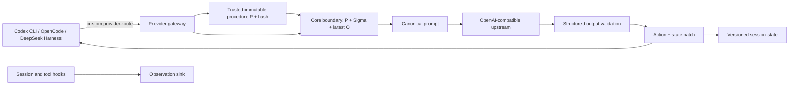

# skill-state

`skill-state` is an independent, open-source implementation of a state-aware
provider boundary for agent clients. It keeps bounded session state in a
versioned store, projects the current state into one canonical model request,
and validates the provider's state patch and action before they leave the
gateway.

The repository is a reference implementation and a set of patchable client
integrations. It is not affiliated with, sponsored by, or endorsed by OpenAI,
DeepSeek, OpenCode, or the authors of the research paper cited below. Product
names identify compatibility seams only.

## What is here

- `packages/core` contains the state runtime: a trusted immutable procedure
  `P`, JSON limits, a `P + Σ + O` request envelope, merge-patch validation,
  revision checks, procedure hashing, idempotency, and atomic per-session file
  storage.
- `packages/gateway` exposes OpenAI-compatible `/v1/chat/completions` and
  `/v1/responses` routes. It is the mandatory provider interception point: it
  resolves the trusted procedure at startup, receives only the latest
  observation at the core boundary, sends one canonical prompt upstream, and
  accepts only a validated `{state_patch, action}` response.
- `plugin/skill-state` contains the Codex-compatible plugin scaffold and
  companion hooks. Hooks record session and tool observations; they do not
  bypass the gateway.
- `integrations/` contains patchable configuration and adapter seams for the
  Codex CLI custom provider, DeepSeek Harness `LlmAdapter`/`LlmRuntime`, and
  OpenCode provider/plugin hooks.
- `packages/bench` is an optional offline result aggregator. It is off by
  default and is never imported by the core or gateway.

The request path is deliberately explicit:



The gateway buffers provider streams until the complete structured output is
validated. This makes an invalid provider response an explicit error instead
of an emitted action, and it means the first client stream event waits for
provider completion.

## Quick start

Prerequisites are Node.js 20 or newer and npm. From a checkout:

```sh
npm install
npm test
npm run typecheck
```

The gateway is an embeddable HTTP component rather than a standalone daemon.
Construct it with a core object exposing `prepareCall` (the concrete core
provides that method), then pass it to `createHttpServer`. Configuration and
provider-specific examples are documented in [Install and configuration](docs/install.md).

Every non-test gateway startup must bind a trusted procedure. Set
`SKILL_STATE_PROCEDURE_FILE` to the credential-free
[`examples/skill-state-procedure.json`](examples/skill-state-procedure.json),
set `SKILL_STATE_PROCEDURE` to an inline JSON/string procedure, or pass
`procedure` to `createGateway`/`createSkillStateCore`. Client request fields
cannot replace this value. Core stores a stable `procedureHash` with each
session and rejects a changed procedure; `allowTestProcedureDefault: true` is
for tests only.

No credential is required for the offline tests. Put provider credentials in
the process environment only, for example
`PROVIDER_UPSTREAM_API_KEY`; do not put values in TOML, JSON, source, fixtures,
or issue comments.

## Documentation

- [Architecture and protocol](docs/architecture.md)
- [Install and configure each client](docs/install.md)
- [Compatibility matrix](docs/compatibility.md)
- [Threat model and deployment boundaries](docs/threat-model.md)
- [Optional benchmark](docs/benchmark.md)
- [References and licenses](docs/references.md)
- [Contributing](CONTRIBUTING.md)
- [Security policy](SECURITY.md)

The ready-to-copy, credential-free fragments are in [examples](examples/README.md).
The integration notes remain next to their adapters in
[`integrations/`](integrations/capabilities.md).

## Research context and independent implementation

The design is informed by the state-centric formulation in *SKILL.state*,
which describes a step as an immutable skill specification, structured state,
and the latest observation, followed by a validated state update. Read the
[arXiv abstract](https://arxiv.org/abs/2608.26263v3),
[HTML paper](https://arxiv.org/html/2608.26263v3), or
[PDF](https://arxiv.org/pdf/2608.26263v3) for the authors' definition and
results. This repository does not claim to reproduce those experiments or
results; its protocol, storage, adapters, and validation code are independent
work.

## License

The repository is released under the [MIT License](LICENSE). The cited paper
is a separate work; its arXiv page links its applicable [CC BY 4.0 license](https://creativecommons.org/licenses/by/4.0/).
