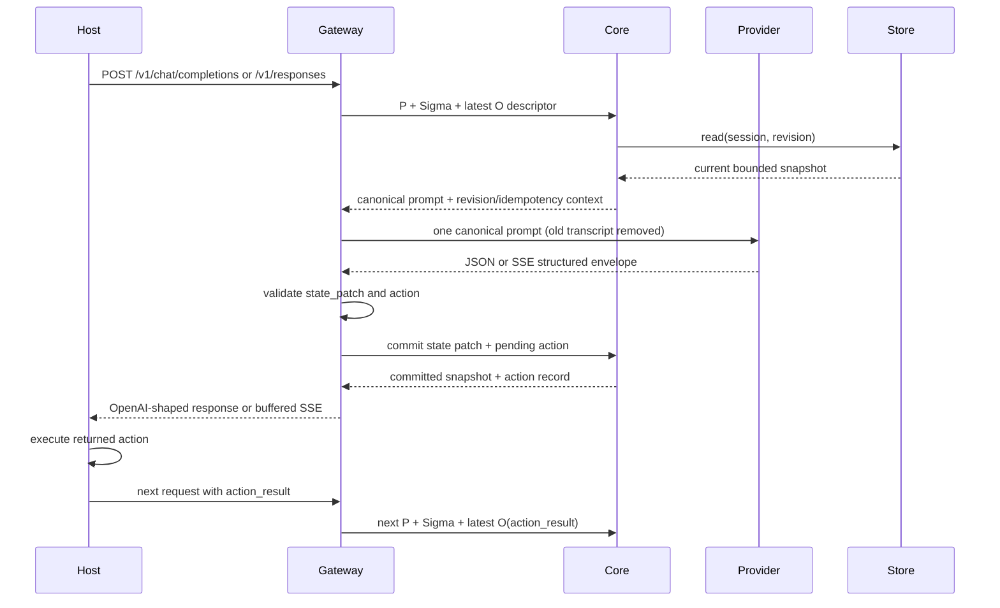

# Architecture and protocol

`skill-state` separates state ownership from provider transport. The core owns
the trusted immutable procedure `P`, session state, and transition rules. The
gateway owns the only provider boundary. Adapters configure client products to
call that gateway; hooks only publish observations.

## Components

| Component | Responsibility | Deliberate boundary |
| --- | --- | --- |
| `@skill-state/core` | Validate the trusted procedure and JSON envelopes/patches, read/write versioned session state, enforce revisions, procedure hashes, and idempotency | Does not make network calls or choose an upstream provider |
| `@skill-state/gateway` | Resolve trusted startup procedure, adapt OpenAI-compatible chat/responses requests, call the core, call the configured upstream, validate structured output | Does not replay client transcripts into the provider or accept a client procedure override |
| Codex plugin hooks | Observe session and tool lifecycle events | Does not route model traffic or retain tool payloads by default |
| Codex, DeepSeek Harness, and OpenCode integrations | Provide client configuration or a patchable provider seam | Do not edit a user's global configuration or store credentials |
| `skill-state-bench` | Aggregate supplied result records and evaluate optional quality gates | Does not run unless explicitly invoked; its default path is offline |

The gateway must remain the provider interception point. A client configured
with an adapter or custom provider that can call the upstream directly is not a
state-aware deployment, even if hooks are installed.

## Trusted immutable procedure

The trusted procedure is startup configuration, not request content. A host can
pass `procedure` to `createGateway` or `createSkillStateCore`, or configure the
gateway with `SKILL_STATE_PROCEDURE` (inline JSON/string) or
`SKILL_STATE_PROCEDURE_FILE` (a JSON/text file). A gateway `procedureFile`
constructor option is also available when the host prefers an explicit path.
The gateway resolves this once at startup and creates the core with the same
procedure when no core is injected. An empty or missing procedure fails closed
in production. `allowTestProcedureDefault: true` may select the built-in test
procedure only in test setup; do not enable it in a deployed host.

The core includes the trusted procedure in the request projection and computes
its stable SHA-256 `procedureHash`. The hash is stored with session state and
action records. A session prepared or committed under a different procedure
fails with `PROCEDURE_CONFLICT`; changing client fields cannot change `P`.
The gateway also verifies that the core returns the startup procedure and
matching hash before calling the upstream.

## State-aware call

For each model call the core receives a bounded descriptor with the protocol
version `p+sigma+latest-o/v1`. The trusted procedure is deliberately absent
from this client-derived descriptor: it is supplied by the core/gateway startup
configuration and added to the projection internally.

```js
{
  protocol: "p+sigma+latest-o/v1",
  endpoint: "/v1/chat/completions", // or "/v1/responses"
  model: "provider-model-id",
  latestObservation: { /* O */ },
  request: {
    stream: false,
    controls: { /* generation controls */ },
    requestId: "request-id"
  }
}
```

The concrete `SkillStateCore.prepareCall()` reads the current session and
returns the projection `p` (containing trusted procedure `P`), state `Σ`,
latest observation `O`, procedure hash, revision, idempotency key, and a
canonical serialized prompt. The gateway accepts this contract through
`prepareCall` or `buildContext`, and requires `commitResponse` (or the explicit
`commitState` alias) for the response transition. A returned context must
include structured `projection`, `sigma`, `procedure`, and matching
`procedureHash` values plus a non-empty `prompt`; there is no prompt-only
fallback.

The gateway resolves `latest_observation` first. It maps `action_result` and
`tool_result` to an observation, and only uses the last client user input as a
start-of-turn fallback. It never forwards `messages`, `input`,
`previous_response_id`, or those routing fields to the core or provider. The
provider receives exactly one canonical message/input containing the core
prompt, plus allowed generation controls.



## Response and commit protocol

The provider's assistant text must parse as:

```json
{
  "state_patch": { "set": { "path": "value" }, "delete": [] },
  "action": { "type": "send_message", "payload": { "text": "hello" } }
}
```

`state_patch` is a JSON merge patch or the optional `set`/`delete` shorthand.
`action` is either `null` or an object with a non-empty string `type` and an
optional JSON `payload`. The gateway rejects malformed JSON, prototype keys,
oversized/deep values, invalid patch paths, and invalid action shapes. It does
not emit an action after a validation failure.

The core's `commitResponse()` requires the prepared `procedureHash`, commits
`state_patch` against the preparation revision and idempotency key, and records
the returned action as a pending action for the host to execute. The core does
not perform the action's external side effect. The session store serializes
updates per session, writes state through atomic replacement, and records enough
action state for a retry to return the original transition instead of applying
it twice. A stale revision, changed procedure hash, conflicting idempotency
key, or unsafe rollback is an explicit error.

The host owns action execution. After it completes an action, it sends the
result in `action_result` (or `tool_result`) on the next request. The gateway
gives that result precedence over generic client text and passes it to core as
the latest observation `O`; this is how external work re-enters the
state-aware loop. The action returned by the provider is therefore a durable
work item, while `action_result` is the observation of its execution.

Provider streaming is buffered until the full text is parsed and validated.
The response includes `x-gateway-stream-buffered: true` so clients can account
for the validation boundary. This is a safety and determinism choice, not a
claim of token-level streaming latency.

## Deployment shape

The gateway is created with `createGateway({ core, upstreamBaseUrl,
upstreamApiKey, upstreamTimeoutMs })` and adapted to Node's HTTP server with
`createHttpServer(gateway)`. The default gateway does not log request or model
payloads. Bind it to loopback for local clients, or put an authenticated
reverse proxy in front of it before exposing it to another host.

The core store defaults to `.skill-state` when no `rootDir` is supplied. Use a
dedicated directory with appropriate filesystem permissions in production and
keep it out of source control. The repository templates use environment
variable names only; they never contain keys or user-specific paths.

## Design reference

The `P + Σ + O` boundary is an independent implementation choice informed by
the state-centric loop described in the
[arXiv abstract](https://arxiv.org/abs/2608.26263v3),
[HTML](https://arxiv.org/html/2608.26263v3), and
[PDF](https://arxiv.org/pdf/2608.26263v3). The repository does not reproduce or
endorse the paper's benchmark claims. See [References](references.md) for the
license and attribution distinction.
